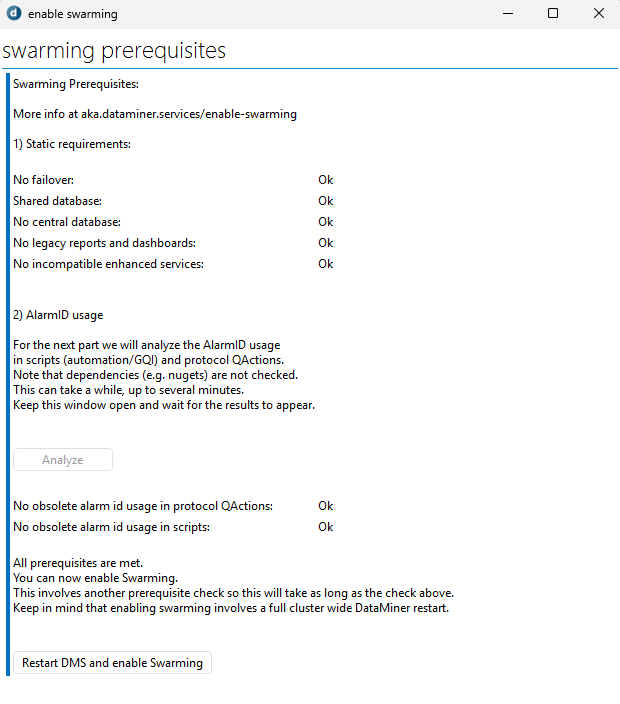

# Tutorial - Getting started with Swarming

## About

This package accompanies the [Getting started with Swarming tutorial](https://aka.dataminer.services/GettingStartedWithSwarmingTutorial).

See also the instructional video in [Kata #61: Getting started with Swarming](https://community.dataminer.services/courses/kata-61/).

## In this package

In this package, you will find the *Enable Swarming* Automation script, which is an interactive script that will guide you through the process of enabling the Swarming feature.

The script will check off all the hard prerequisites, and automatically analyze your Automation scripts and QActions to find out whether no incompatible Alarm IDs are being used.

If everything checks out, you can order your DMS to enable Swarming cluster wide. However, note that this requires a full DMS restart.

## Prerequisites

To deploy this integration from the Catalog, you will need:

- DataMiner version 10.5.1+/10.6.0+
- A DataMiner System connected to dataminer.services
